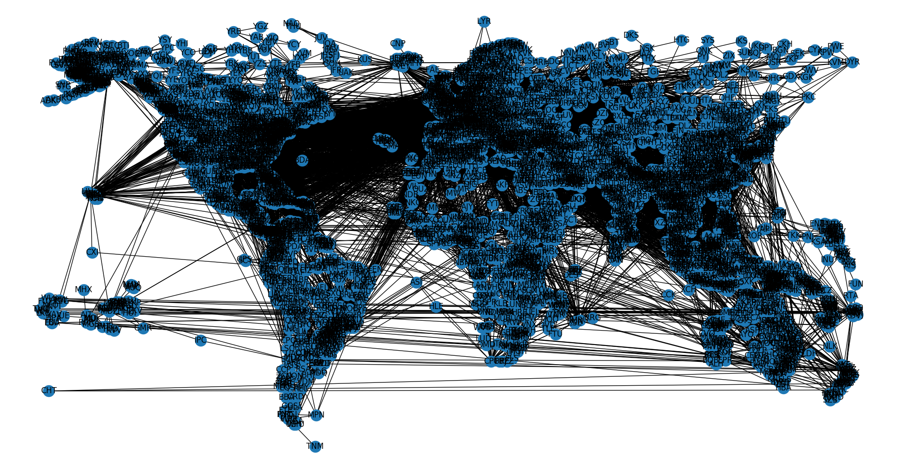

# Wikipedia Flights

Turns out, Wikipedia has entries on basically any given airport. If you go to the page of that airport, it tells you all the locations it flies to.

I realized that if you scrape all of that data, you could easily make a graph of airports with their connections and satisfy any curiosity you may have.

Despite impracticality for actual travel planning, unlike others, this implementation would allow you to:
- Find routes with least physical distance traveled, no matter the layover
- Since Wikipedia is crowdsourced, there's a lot of obscure data here that just isn't indexed on typical travel search engines
- Explore routes and possibilities avoided by typical travel search engines


## Examples

Current, rudimentary functionality example:

Running `getConnectionRundown("Pittsburgh_International_Airport", "Incheon_International_Airport")` would output:

```
There are 15 routes with least layovers from Pittsburgh to Seoul:
    Pittsburgh -> Atlanta -> Seoul
    Pittsburgh -> Boston -> Seoul
    Pittsburgh -> Dallas / Fort Worth -> Seoul
    Pittsburgh -> Detroit -> Seoul
    Pittsburgh -> Frankfurt -> Seoul
    Pittsburgh -> Washington -> Seoul
    Pittsburgh -> New York City -> Seoul
    Pittsburgh -> Las Vegas -> Seoul
    Pittsburgh -> Los Angeles -> Seoul
    Pittsburgh -> London -> Seoul
    Pittsburgh -> Minneapolis / St Paul -> Seoul
    Pittsburgh -> Chicago -> Seoul
    Pittsburgh -> Toronto -> Seoul
    Pittsburgh -> Seattle -> Seoul
    Pittsburgh -> San Francisco -> Seoul

The route with least distance travelled (10975km) is:
    Pittsburgh -> Toronto -> Seoul
```

---

Generally, the further the locations are, the less optimal routes there are. For example: running `getConnectionRundown("San_Francisco_International_Airport", "Ivato_International_Airport")` would get you:

```
There are 3 routes with least layovers from San Francisco to Antananarivo:
    San Francisco -> Guangzhou -> Antananarivo
    San Francisco -> Paris -> Antananarivo
    San Francisco -> Istanbul -> Antananarivo

The route with least distance travelled (17707km) is:
    San Francisco -> Amsterdam -> Mombasa -> Moroni -> Antananarivo
```

The least distance travelled route is often more layovers than the optimal ones.

## TODO

- Create web interface, which would allow:
    - Easier exploration of graph
    - Streamlined path searching/other fun stuff
    - And all download-free!